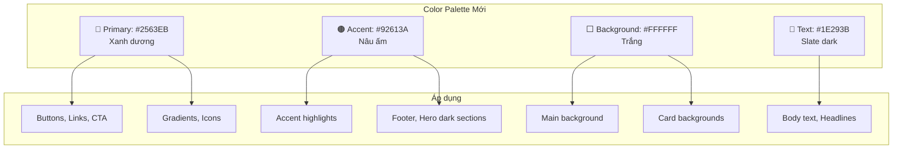

# Plan: Đổi Slogan & Bảng Màu Website aivan.vn

> **Ngày tạo:** 2026-03-02
> **Trạng thái:** PENDING
> **Ước lượng:** ~3-4 files, ~120+ thay đổi

---

## 1. Overview

### Problem Statement
- Slogan hiện tại: **"Giải pháp AI cho doanh nghiệp"** → chưa truyền tải đúng sứ mệnh
- Bảng màu hiện tại: **dark theme cam-nâu đen** (`#ec6d13` primary orange) → cần chuyển sang **trắng - xanh dương - nâu**

### Proposed Solution
1. Đổi slogan thành: **"Sứ mệnh xây dựng nền tảng AI vận hành cho doanh nghiệp Việt"**
2. Chuyển toàn bộ color scheme sang palette **trắng - xanh dương - nâu**

### Scope
- Thay đổi text content (slogan, SEO meta, các headline liên quan)
- Thay đổi toàn bộ hệ thống màu sắc (CSS variables, Tailwind config, inline colors)
- Cập nhật favicon SVG

---

## 2. Bảng Màu Mới (Trắng - Xanh Dương - Nâu)

### 2.1 Design Tokens

| Token | Hiện tại | Mới | Vai trò |
|-------|----------|-----|---------|
| `primary` | `#ec6d13` (cam) | `#2563EB` (xanh dương) | Nút bấm, accent chính, CTA |
| `primary-hover` | `#d55f0f` | `#1D4ED8` | Hover state của primary |
| `primary-light` | — | `#DBEAFE` | Background nhẹ, badge |
| `accent-warm` | `#ff3b30` (đỏ) | `#92613A` (nâu ấm) | Accent phụ, điểm nhấn nâu |
| `accent-warm-light` | — | `#C4956A` | Hover accent nâu |
| `background-dark` | `#181411` | `#FFFFFF` (trắng) | Nền chính |
| `background-alt` | — | `#F5F0EB` (kem nhẹ) | Nền section xen kẽ |
| `surface` | `#1d1d1f` | `#FFFFFF` (trắng) | Card background |
| `surface-hover` | `#2c2c2e` | `#F8F5F1` | Card hover |
| `surface-dark` | `#231f1a` | `#3B2F25` (nâu đậm) | Section dark (footer, hero) |
| `surface-highlight` | `#2f2924` | `#EDE8E3` | Skeleton loading |
| `text-primary` | `#f5f5f7` (trắng) | `#1E293B` (slate dark) | Text chính |
| `text-secondary` | `#86868b` | `#64748B` | Text phụ |
| `text-on-dark` | — | `#FFFFFF` | Text trên nền tối |
| `border` | `#392f28` | `#D6CEC7` (nâu nhạt) | Viền card |
| `border-hover` | `#54453b` | `#B8ADA4` | Viền hover |

### 2.2 Gradient mới

| Gradient | Hiện tại | Mới |
|----------|----------|-----|
| `text-gradient` | `#ffffff → #a1a1aa` | `#2563EB → #92613A` (xanh dương → nâu) |
| Hero gradient | `from-primary to-orange-400` | `from-[#2563EB] to-[#92613A]` |
| Button glow | `rgba(236,109,19,...)` | `rgba(37,99,235,...)` |

### 2.3 Màu giữ nguyên (status/feedback)

| Màu | Hex | Vai trò |
|-----|-----|---------|
| Success | `#22c55e` | Trạng thái thành công |
| Warning | `#f59e0b` | Cảnh báo |
| Error | `#ef4444` | Lỗi |

---

## 3. Thay Đổi Slogan & Nội Dung

### 3.1 Hero chính (index.html)

| Vị trí | Hiện tại | Mới |
|--------|----------|-----|
| **Hero title** (line ~137-140) | `Giải pháp AI` / `cho doanh nghiệp.` | `Nền tảng AI vận hành` / `cho doanh nghiệp Việt.` |
| **Hero subtitle** (line ~143-145) | `Chiến lược AI được thiết kế riêng, nâng tầm hiệu suất.` | `Sứ mệnh xây dựng nền tảng AI vận hành cho doanh nghiệp Việt.` |

### 3.2 SEO Meta Tags (index.html)

| Tag | Hiện tại | Mới |
|-----|----------|-----|
| `<title>` (line 12) | `aivan.vn - Giải pháp AI tối ưu cho doanh nghiệp` | `aivan.vn - Nền tảng AI vận hành cho doanh nghiệp Việt` |
| `meta description` (line 13) | `...Giải pháp AI tối ưu cho doanh nghiệp...` | `aivan.vn - Sứ mệnh xây dựng nền tảng AI vận hành cho doanh nghiệp Việt. Tư vấn chiến lược AI, tự động hóa quy trình.` |
| `og:title` (line 20) | `aivan.vn - Giải pháp AI tối ưu cho doanh nghiệp` | `aivan.vn - Nền tảng AI vận hành cho doanh nghiệp Việt` |
| `og:description` (line 21) | `Chiến lược trí tuệ nhân tạo...` | `Sứ mệnh xây dựng nền tảng AI vận hành cho doanh nghiệp Việt.` |
| `twitter:title` (line 30) | `aivan.vn - Giải pháp AI tối ưu cho doanh nghiệp` | `aivan.vn - Nền tảng AI vận hành cho doanh nghiệp Việt` |
| `twitter:description` (line 31) | `Chiến lược trí tuệ nhân tạo...` | `Sứ mệnh xây dựng nền tảng AI vận hành cho doanh nghiệp Việt.` |
| `theme-color` (line 17) | `#181411` | `#2563EB` |

### 3.3 Các headline phụ (index.html)

| Line ~ | Hiện tại | Mới |
|--------|----------|-----|
| ~435 | `Khám phá tiềm năng AI cho doanh nghiệp bạn` | `Khám phá nền tảng AI vận hành cho doanh nghiệp bạn` |
| ~891 | `Sẵn sàng để bứt phá?` | Giữ nguyên |
| ~1097 | `Lĩnh vực cần giải pháp AI?` | Giữ nguyên |
| ~1200-1202 | `Chiến lược AI cho Doanh nghiệp` | `Nền tảng AI vận hành cho Doanh nghiệp` |
| ~1601 | `Sẵn sàng chuyển đổi AI?` | Giữ nguyên |

---

## 4. File Changes Chi Tiết

### 4.1 `index.html` — ~40 thay đổi

| Khu vực | Dòng ~ | Mô tả thay đổi |
|---------|--------|-----------------|
| Meta tags | 12-31 | Đổi title, description, OG, Twitter |
| theme-color | 17 | `#181411` → `#2563EB` |
| Tailwind config | 56-66 | Đổi toàn bộ color tokens |
| Hero title | 137-140 | Đổi slogan chính |
| Hero subtitle | 143-145 | Đổi tagline |
| Badge | 133 | Đổi style badge (bg color) |
| Trust badges | 170-175 | Đổi color classes |
| Inline colors | scattered | Đổi tất cả `#ec6d13`, `#181411`, `#231f1a` inline |
| Gradient classes | scattered | `from-primary to-orange-400` → `from-primary to-[#92613A]` |
| Background classes | scattered | `bg-background-dark` → `bg-white` hoặc `bg-background-alt` |
| Text color classes | scattered | `text-white` → `text-slate-800` (trên nền sáng) |
| Shadow rgba | scattered | `rgba(236,109,19,...)` → `rgba(37,99,235,...)` |
| Section headlines | 435, 1200 | Đổi text liên quan slogan |
| `class="dark"` | 2 | Xóa class `dark` trên `<html>` |

### 4.2 `styles.css` — ~60 thay đổi

| Khu vực | Dòng ~ | Mô tả thay đổi |
|---------|--------|-----------------|
| CSS variables `:root` | 7-18 | Đổi toàn bộ color tokens |
| Body styles | ~48 | `color: #f5f5f7` → `#1E293B` |
| `text-gradient` | ~129 | `#ffffff → #a1a1aa` → `#2563EB → #92613A` |
| Hover states | scattered | `#d55f0f` → `#1D4ED8` |
| `accent-red` refs | scattered | `#ff3b30` → `#92613A` |
| Background colors | scattered | Dark values → light values |
| Border colors | scattered | `#392f28` → `#D6CEC7` |
| Box shadows | scattered | `rgba(236,109,19,...)` → `rgba(37,99,235,...)` |
| Scrollbar colors | scattered | Dark → light theme |
| Selection color | scattered | Orange → blue highlight |

### 4.3 `app.js` — ~25 thay đổi

| Khu vực | Dòng ~ | Mô tả thay đổi |
|---------|--------|-----------------|
| Workflow step colors | 82, 91, 100 | `#ec6d13` → `#2563EB` |
| Chart colors | ~1755 | `#ec6d13` → `#2563EB` trong palette |
| Score rating colors | 1126-1130 | Cập nhật color scale |
| Industry gradients | 67, 117, 167 | Điều chỉnh cho phù hợp palette mới |
| Tool brand colors | 224-891 | **Giữ nguyên** (màu thương hiệu của tool bên thứ ba) |

### 4.4 `favicon.svg` — ~8 thay đổi

| Khu vực | Mô tả thay đổi |
|---------|-----------------|
| `cubeGrad` | `#f97316 → #ea580c` → `#2563EB → #1D4ED8` |
| `topGrad` | `#fb923c → #f97316` → `#60A5FA → #2563EB` |
| `sideGrad` | `#ea580c → #c2410c` → `#1D4ED8 → #1E40AF` |
| Background rect | `#1a1a1a` → `#3B2F25` (nâu đậm) |
| Right face fill | `#f97316` → `#2563EB` |
| Stroke colors | `#fb923c`, `#c2410c` → blue tones |

---

## 5. Implementation Checklist

### Phase 1: Color System (ưu tiên cao)
- [ ] 1.1 Cập nhật Tailwind config colors trong `index.html` (line 56-66)
- [ ] 1.2 Cập nhật CSS custom properties trong `styles.css` (line 7-18)
- [ ] 1.3 Cập nhật body default color trong `styles.css`
- [ ] 1.4 Cập nhật `text-gradient` definition trong `styles.css`

### Phase 2: Slogan & Content
- [ ] 2.1 Đổi hero title trong `index.html` (line 137-140)
- [ ] 2.2 Đổi hero subtitle trong `index.html` (line 143-145)
- [ ] 2.3 Cập nhật tất cả SEO meta tags (title, description, OG, Twitter)
- [ ] 2.4 Cập nhật theme-color meta
- [ ] 2.5 Cập nhật các headline phụ (line 435, 1200)

### Phase 3: Light Theme Conversion
- [ ] 3.1 Xóa `class="dark"` trên `<html>`
- [ ] 3.2 Đổi tất cả `bg-background-dark` → nền trắng/kem
- [ ] 3.3 Đổi tất cả `text-white` trên nền sáng → `text-slate-800`
- [ ] 3.4 Cập nhật card backgrounds & borders
- [ ] 3.5 Cập nhật nav/header styles cho light theme

### Phase 4: Inline Colors & Gradients
- [ ] 4.1 Find & replace tất cả `#ec6d13` → `#2563EB` trong `index.html`
- [ ] 4.2 Find & replace tất cả `rgba(236,109,19,...)` → `rgba(37,99,235,...)`
- [ ] 4.3 Cập nhật gradient classes (`to-orange-400` → `to-[#92613A]`)
- [ ] 4.4 Find & replace orange hex variants trong `styles.css`
- [ ] 4.5 Find & replace dark background hexes trong `styles.css`

### Phase 5: JavaScript Colors
- [ ] 5.1 Cập nhật workflow step colors trong `app.js`
- [ ] 5.2 Cập nhật chart palette trong `app.js`
- [ ] 5.3 Cập nhật score rating colors trong `app.js`
- [ ] 5.4 Điều chỉnh industry card gradients

### Phase 6: Favicon
- [ ] 6.1 Cập nhật tất cả gradient colors trong `favicon.svg`
- [ ] 6.2 Đổi background color

### Phase 7: QA & Polish
- [ ] 7.1 Kiểm tra contrast ratio (WCAG AA) cho text trên nền mới
- [ ] 7.2 Kiểm tra tất cả hover/active states
- [ ] 7.3 Kiểm tra responsive trên mobile
- [ ] 7.4 Kiểm tra dark-mode utility classes không còn conflict

---

## 6. Dependencies

### External
- Không có dependency mới cần cài đặt
- Tailwind CDN vẫn giữ nguyên

### Internal
- Phase 1 (Color System) phải xong trước Phase 3-5
- Phase 2 (Slogan) độc lập, có thể làm song song với Phase 1

---

## 7. Risks & Mitigations

| Risk | Impact | Mitigation |
|------|--------|------------|
| Contrast ratio thấp trên light theme | Accessibility fail | Dùng `#1E293B` cho text (ratio 13:1 trên trắng) |
| Text trắng trên nền sáng bị ẩn | UI broken | Scan toàn bộ `text-white` classes, chỉ giữ trên nền tối |
| `dark:` Tailwind utilities conflict | Style lỗi | Xóa class `dark` trên html, review tất cả `dark:` prefixed classes |
| Tool brand colors bị đổi nhầm | Sai thương hiệu | Giữ nguyên 30+ tool brand colors trong `app.js` |
| `text-secondary` mismatch CSS vs Tailwind | Inconsistent styling | Sync cả 2 về cùng `#64748B` |
| Hardcoded rgba values bị sót | Có chỗ vẫn cam | Grep kỹ `236,109,19` và `236, 109, 19` |

---

## 8. Acceptance Criteria

- [ ] Slogan hero hiển thị: **"Nền tảng AI vận hành / cho doanh nghiệp Việt."**
- [ ] Subtitle hiển thị: **"Sứ mệnh xây dựng nền tảng AI vận hành cho doanh nghiệp Việt."**
- [ ] Tất cả SEO meta phản ánh slogan mới
- [ ] Primary color = xanh dương `#2563EB` trên toàn site
- [ ] Accent color = nâu `#92613A` ở các điểm nhấn
- [ ] Background chính = trắng `#FFFFFF`
- [ ] Không còn màu cam `#ec6d13` nào trên site (trừ tool brand colors)
- [ ] Favicon hiển thị cube xanh dương trên nền nâu đậm
- [ ] Contrast ratio WCAG AA pass cho tất cả text
- [ ] Responsive hoạt động bình thường trên mobile/tablet

---

## 9. Visual Preview (Mermaid)

---

> **Tiếp theo:** Chuyển sang `claude-builder` để implement theo checklist trên.
